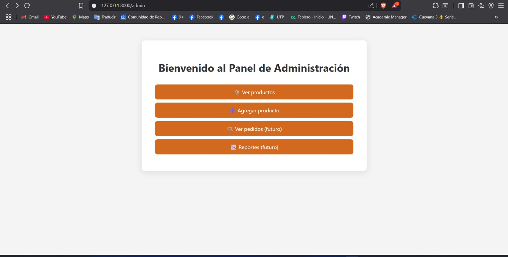
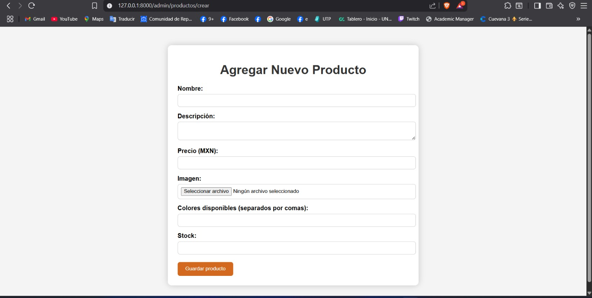
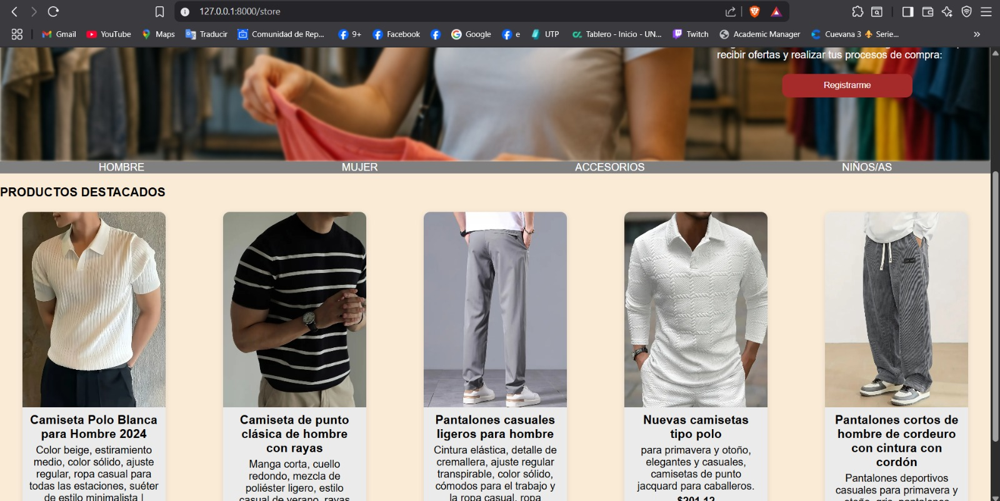

# 🧥 Tienda de Ropa – Mini Ecommerce (Laravel)

Proyecto universitario: simulación de una tienda de ropa con **Laravel**.  
Muestra productos desde **MySQL (XAMPP)**, incluye **panel de administración** para crear productos y una **API JSON** que el frontend consume para renderizar el catálogo dinámicamente.

> ⚠️ Estado actual: **MVP** – solo la función "Crear producto" está operativa en el panel admin.

---

## 📸 Vista previa

### Panel de Administración


### Crear producto


### Tienda (Home)


---

## 🧰 Tecnologías utilizadas

- **Backend**: PHP 8+, Laravel 10/11
- **Base de Datos**: MySQL (XAMPP)
- **Frontend**: Blade + JavaScript (fetch API)
- **Storage**: Laravel Storage (`storage/app/public/loads`) + `php artisan storage:link`

---

## 🚀 Instalación

```bash
# 1) Clonar el repositorio
git clone https://github.com/<tu_usuario>/<tu_repo>.git
cd <tu_repo>

# 2) Instalar dependencias
composer install

# 3) Copiar y configurar el archivo .env
cp .env.example .env
# Configura las variables DB_* y APP_URL en .env

# 4) Generar la clave de la app
php artisan key:generate

# 5) Ejecutar migraciones (si aplican)
php artisan migrate

# 6) Crear enlace simbólico para el storage
php artisan storage:link

# 7) Iniciar el servidor
php artisan serve
# → http://127.0.0.1:8000
